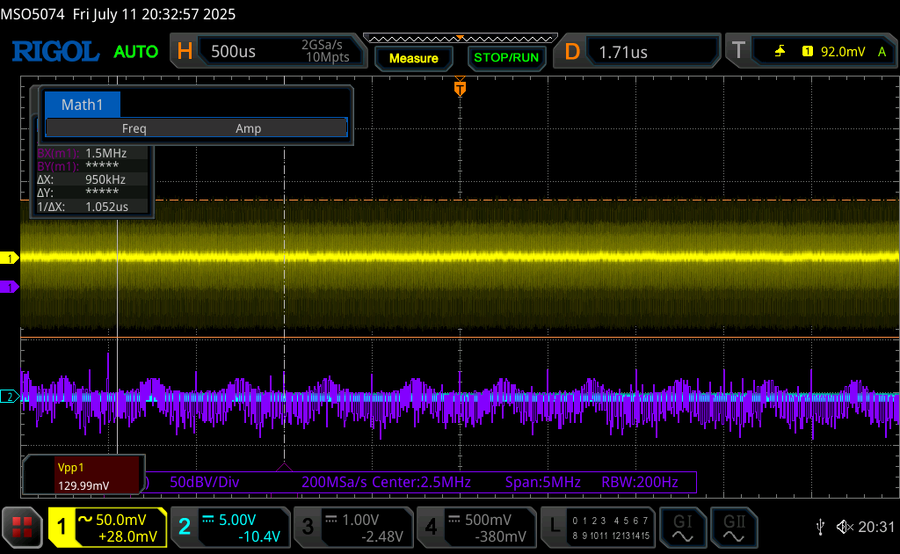
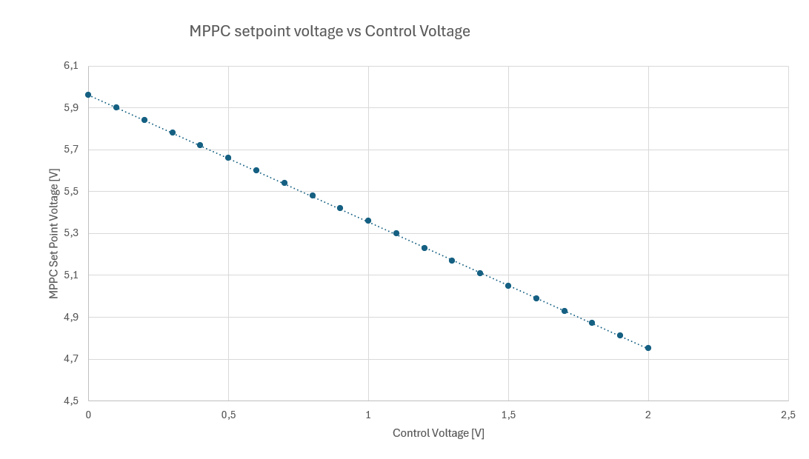

# LTC3119-testboard
LTC3119 testbord is a device build to test MPPT adaptation of this DCDC converter

## Schematic

## Tests Documentation

### Configuration A
- Configuration of a testbed before tests:
    - Input Capacitance: 4 x 22 uF
    - Output Capacitance: 4 x 22uF
    - MPPC Compensation: 10nF, 1k47 Ohm (C5, R5)
    - Evrything else: same as in design files

- Nominal operation - Output noice mesurment (probed directly with coaxial cable with 50 ohm terminantion on oscilosope)
    - No external load (PSU not current limited)  
    
    - External load 1A (PSU not current limited)  
    
    - External load 2A (PSU not current limited)  
    
    - External load 3A (PSU not current limited)  
    

- MPPC Test - Output Voltage and noice mesurment (probed directly with coaxial cable with 50 ohm terminantion on oscilosope)
    - External load 1A - Messured output voltage - 4.09 V (voltage messured on electronic load, not compensated for voltage drop on cables) (PSU limited to 1A - not active)  
    
    - External load 1A5 - Messured output voltage - 3.13 V (voltage messured on electronic load, not compensated for voltage drop on cables) (PSU limited to 1A - active)   
    
    - External load 2A - Messured output voltage - 2.25 V (voltage messured on electronic load, not compensated for voltage drop on cables) (PSU limited to 1A - active)  
    
    - External load 1A3 - Messured output voltage - 3.63 V (voltage messured on electronic load, not compensated for voltage drop on cables) (PSU limited to 1A - active) (IMPORTANT: FFT for low frequency noice)
    

- MPPC Input voltage regulation setpoint vs control voltage  
  

### Configuration B
- Configuration of a tesbed before test:    
    - Input Capacitance: 4 x 22 uF
    - Output Capacitance: 4 x 22uF
    - MPPC Set point Components: 226k Ohm, 1M25 Ohm, 470k Ohm (R3, R2, R6)
    - MPPC Compensation: 2.2nF, 6k8 Ohm (C5, R5)
    - Evrything else: same as in design files

-  MPPC Test - Noice mesurment (probed directly with coaxial cable with 50 ohm terminantion on oscilosope)
   - External load 1A (PSU limited to 1A - not active)  
    
    - External load 1A5 (PSU limited to 1A - active)   
    
    - External load 2A (PSU limited to 1A - active)  
    
    - External load 1A3 - Messured output voltage - 3.63 V (PSU limited to 1A - active) (IMPORTANT: FFT for low frequency noice)
    
 
